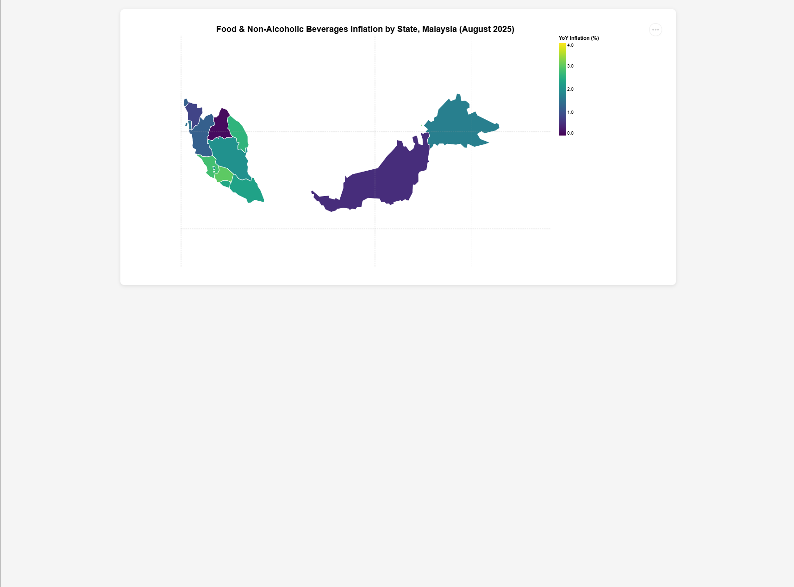

# FIT3179 Week 9 Homework Report

## Malaysia Food Inflation Choropleth Map

---

### Student Information

**Name:** Suman Datta
**Student ID:** 30668786
**Lab:** Friday, 13:00
**Tutor:** Dr. Chai Wen Ting

---

### GitHub Pages URL

**Map URL:** `https://suman-datta-monash.github.io/fit3179-week9-homework/`

---

### Map Screenshot

---

### Analysis

#### Domain

Malaysian food affordability and inflation trends, exploring regional disparities in cost of living. This visualization examines how Food & Non-Alcoholic Beverages inflation varies across Malaysian states, providing insight into geographic patterns of food price increases and their relationship to household income levels.

#### Dataset

Two primary datasets from Malaysia's Department of Statistics (DOSM), accessed September 2025 from storage.dosm.gov.my:

1. **CPI 2-digit State Inflation CSV** (`cpi_2d_state_inflation.csv`):

   - Quantitative attributes: `inflation_yoy` (year-over-year %), `inflation_mom` (month-over-month %), `date` (temporal)
   - Nominal attributes: `state` (16 states/territories), `division` (CPI category codes)
   - Data filtered to division `01` (Food & Non-Alcoholic Beverages) for August 2025

2. **Household Income State CSV** (`hh_income_state.csv`):

   - Quantitative attributes: `income_median` (RM), `income_mean` (RM), `date` (temporal)
   - Nominal attribute: `state` (16 states/territories)
   - Data extracted for year 2022 (most recent available household income survey)

3. **Malaysia States TopoJSON** (geographic boundaries, sourced from GitHub):
   - Geometry data for 16 Malaysian states/federal territories
   - Size: ~4.7 KB (well under 100 KB limit)

#### Transformation

Multiple data transformations were applied to prepare the visualization:

1. **Temporal filtering**: CPI data filtered to August 2025 (most recent month); income data filtered to 2022 (latest available survey year)

2. **Category filtering**: CPI data filtered to division code `01` (Food & Non-Alcoholic Beverages only), excluding overall inflation and other CPI categories

3. **State name normalization**: Inconsistent state naming conventions harmonized across datasets:

   - W.P. Kuala Lumpur → Kuala Lumpur
   - W.P. Labuan → Labuan
   - W.P. Putrajaya → Putrajaya
   - Pulau Pinang → Penang

4. **Data joining**: CPI inflation and household income datasets joined in-memory using normalized state names as the key

5. **No population/area normalization required**: Year-over-year inflation is already a rate/ratio, making it inherently suitable for choropleth mapping without additional normalization

#### Justification

A **choropleth map** was selected as the primary visualization idiom for the following reasons:

1. **Data appropriateness**: YoY inflation is a normalized rate (percentage), making it suitable for comparison across states with vastly different populations and geographic areas. Choropleth maps excel at displaying ratio/rate data across administrative regions.

2. **Geographic patterns**: The map idiom effectively reveals spatial patterns and regional clustering of food inflation, allowing viewers to identify whether inflation is geographically concentrated (e.g., Peninsular vs East Malaysia, urban vs rural states).

3. **Color scheme**: The **viridis** sequential color scheme was chosen for optimal perceptual uniformity and colorblind accessibility (safe for protanopia, deuteranopia, and tritanopia). This scheme (dark purple → bright yellow-green) clearly communicates the magnitude gradient from low to high inflation.

4. **Alternative idioms rejected**:

   - **Proportional symbols** (circles): Would misleadingly suggest inflation is an absolute quantity rather than a rate
   - **Graduated symbols**: Same limitation as proportional symbols
   - **Bar/column charts**: Would lose the critical geographic/spatial context
   - **Heatmap (grid)**: Less intuitive for readers familiar with Malaysia's geography

5. **Interactivity**: Tooltips provide detailed state-level data (inflation %, median income) without cluttering the map, supporting both overview (pattern identification) and detail (specific values) tasks.

6. **Graticule inclusion**: 5° latitude/longitude grid lines provide geographic reference and scale awareness, crucial for accurate spatial interpretation.

---

### Technical Implementation Notes

- **Projection**: Mercator, centered at 109.5°E, 4°N with scale 2400 (optimized for Malaysia)
- **Libraries**: Vega-Lite 5.16.3, D3.js v7, Vega-Embed 6.24.0
- **Data processing**: Client-side CSV parsing and joining using D3.js
- **Legend**: Quantitative scale with 0.1% precision formatting
